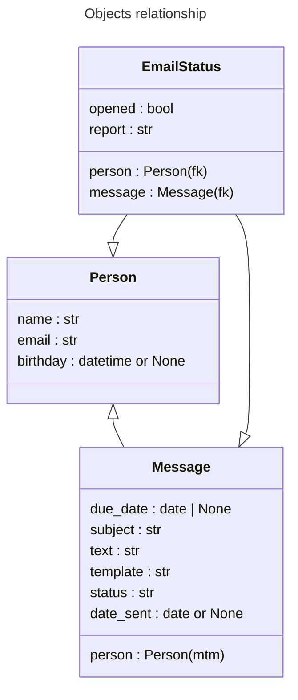

# Функционал

## Объекты

### Person
Содержит имя, email и необязательный день рождения по которому можно этих пользователей фильтровать. На странице выбранного пользователя также отображается инлайн таблица связанных с ним EmailStatus объектов.

### Message
Создается после того как сообщение отправлено через форму. Содержит список получателей (many to many), необязательную дату и время будущего отправления, тему и текст сообщения, имя шаблона, cтатус, дату совершенной рассылки. На странице выбранного сообщения также отображается инлайн таблица связанных с ним EmailStatus объектов. 

По умолчанию принимает статус "Ожидает". Непосредственно перед асинхронной отправкой принимает статус "В работе", чтобы celery beat его проигнорировал. Затем принимает статус "Отправлено" или "Отменено" в зависимости от того произошла ошибка в асинхронной задаче или нет. 

Сообщения можно фильтровать по всем параметрам.

### EmailStatus
Содержит указатели на Person и Message (foreign key), статус указывающий на то, что письмо было открыто получателем, и отчет, в который записываются в виде лога такие данные как: дата создания, открытия, ошибки и так далее.

Можно филтровать по всем параметрам кроме отчета.

## Форма создания нового сообщения
Сервис использует встроенные возможности django admin для управления рассылкой.

На страницу http://127.0.0.1:8000/admin/app/person/ добавлена кнопка __"Отправить сообщение"__ которая открывает всплывающее окно с формой отправки сообщения для выбранных пользователей. 

В форме необходимо ввести тему, сообщение и выбрать шаблон, а также необязательную дату отправления.

Если дата не указана сообщение будет отправлено немедленно всем выбранным пользователям, в противном случае его отправит celery beat настроенный на ежедневный период, каждый час с 9 - 18 часов.

Сообщение поддерживает html синтаксис и конструкции django template engine. То есть можно отображать контент на заданных условиях используя , или просто подставлять {{ username }}, {{ birthday }}.

Доступен предпросмотр введенных данных на выбранном шаблоне во всплывающем окне по нажатию на кнопку "Предпросмотр" рядом со списком шаблонов в форме.

## Логи
Все логи пишутся в mailservice/log/. Для django и celery настроены по 2 лога: debug.log и error.log.

## Шаблоны
Находятся в директории mailservice/app/templates/mail_templates/

## Запуск
- Установить:
    - python2.7
    - pip
    - rabbitmq-server
    - requirements

## Тестирование
Для 