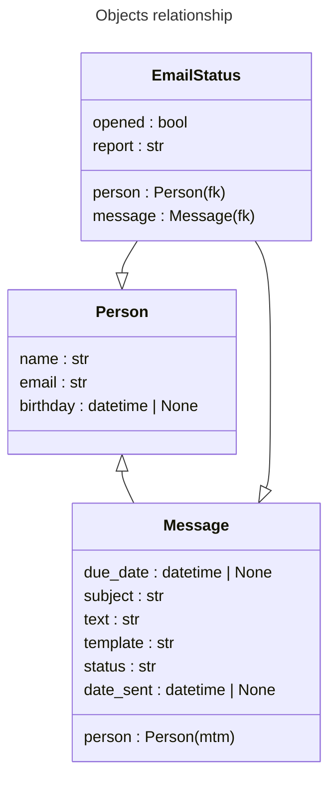

# Прототип сервиса рассылки электронных писем

- [Возможности](#возможности)
    - [Рассылка писем подписчикам из базы данных](#рассылка-писем-подписчикам-из-базы-данных)
    - [Настройка периода обработки отложенных рассылок](#настройка-периода-обработки-отложенных-рассылок)
    - [Шаблоны писем](#шаблоны-писем)
    - [Поддержка django template engine для пользовательских собщений](#поддержка-django-template-engine-для-пользовательских-собщений)
    - [Отслеживание открытых писем](#отслеживание-открытых-писем)
    - [Предпросмотр письма для выбранного шаблона](#предпросмотр-письма-для-выбранного-шаблона)
- [Модели](#модели)
    - [Person](#person)
    - [Message](#message)
    - [EmailStatus](#emailstatus)
- [Форма создания нового сообщения](#форма-создания-нового-сообщения)
- [Логи](#логи)
- [Шаблоны](#шаблоны)
- [Установка](#установка)
- [Тестовый запуск](#тестовый-запуск)

## Возможности

### Рассылка писем подписчикам из базы данных
Письма можно отправлять как немедленно так и планировать отправление на определенную дату и время. Для немедленных используется `celery worker`. Для отложенных -- `celery beat`.

### Настройка периода обработки отложенных рассылок
Удобное ограничение для того, чтобы, к примеру, письма рассылались только в рабочие часы, даже если они были запланированы на ночь (будет отправлено на следующий день). Ограничение периода может быть любым - от ежеминутного до ежегодного, либо отсутствовать (`celery.shedules.crontab`).

### Шаблоны писем
Доступна возможность создавать новые шаблоны которые будут доступны для выбора в форме создания нового сообщения. Шаблон поддерживает HTML, CSS и django template синтаксисы. Может расширяться другими шаблонами. Каждый такой шаблон содержит тэг `{{ content | safe }}` для того, чтобы отображать содержимое пользовательского сообщения отправлемого через форму создания нового сообщения.

### Поддержка django template engine для пользовательских собщений
Пользователь, создающий сообщение, имеет возможность использовать HTML, CSS а также синтаксические конструкции django template engine. Например можно вставлять данные адресатов из базы данных `{{ username }}`, `{{ birthday }}`, создавать условные конструкции ``, создавать циклы ``, наследоваться от других шаблонов ``, использовать различные блоки ``, ``, `{{ block.super }}` предусмотренные родительским шаблоном, и так далее. Однако рендерится сообщение, со своим контекстом, отдельно от шаблона письма .

### Отслеживание открытых писем
Отслеживается запрос на загрузку изображения в теле письма. Запрос также предоставляет id ползователя и id письма. На основе этих данных в базе создается объект отчета в который записываются логи того когда письмо было создано/отправлено/отменено, сколько раз и когда письмо было открыто. Отчет предназначен для хранения любой полезной информации связанной с конкретным письмом отправленным конкретному адресату.

### Предпросмотр письма для выбранного шаблона
В форме создания нового сообщения предусмотрена возможность посмотреть на то, как письмо будет выглядеть для адресата. То есть оно ренедерится на сервере с шаблонным контекстом и затем асинхронно возвращается во фронтенд пользователю.

## Модели

### Person
Содержит имя, email и необязательный день рождения по которому можно этих пользователей фильтровать. На странице редактирования объекта Person также отображается инлайн таблица связанных с ним EmailStatus объектов.

### Message
Создается после того как сообщение отправлено через форму. Содержит список получателей (many to many), необязательную дату и время будущего отправления, тему и текст сообщения, имя шаблона, cтатус, дату совершенной рассылки. На странице выбранного сообщения также отображается инлайн таблица связанных с ним EmailStatus объектов. 

Сообщение создается одно для выбранного списка пользователя и впоследствии может переиспользоваться не захламляя базу данных.

По умолчанию принимает статус "Ожидает". Непосредственно перед асинхронной отправкой принимает статус "В работе", чтобы celery beat его проигнорировал. Затем принимает статус "Отправлено" или "Отменено" в зависимости от того произошла ошибка в асинхронной задаче или нет. 

Сообщения можно фильтровать по всем параметрам.

### EmailStatus
Содержит указатели на Person и Message (foreign key), статус указывающий на то, что письмо было открыто получателем, и отчет, в который записываются в виде лога такие данные как: дата создания, открытия, ошибки и так далее.

Также отображается на страннице редактирования связанных объектов в виде инлайн таблицы в режиме только для чтения.

Можно фильтровать по всем параметрам кроме отчета.

## Форма создания нового сообщения
Сервис использует встроенные возможности django admin для управления рассылкой.

На страницу http://127.0.0.1:8000/admin/app/person/ добавлена кнопка __"Отправить сообщение"__ которая открывает всплывающее окно с формой отправки сообщения для выбранных пользователей. 

В форме необходимо ввести тему, сообщение и выбрать шаблон, а также необязательную дату отправления.

Если дата не указана, сообщение будет отправлено немедленно всем выбранным пользователям, в противном случае его отправит celery beat настроенный на ежедневный период, каждый час с 9 - 18 часов.

Сообщение пользователя поддерживает html синтаксис и конструкции django template engine. То есть в теле письма можно отображать контент на заданных условиях используя ``, совершать итерации, или просто подставлять переменные `{{ username }}`, `{{ birthday }}`.

Доступен предпросмотр введенных данных на выбранном шаблоне во всплывающем окне по нажатию на кнопку __"Предпросмотр"__ рядом со списком шаблонов в форме.

## Логи
Все логи сохраняются в `mailservice/log/`. Для django и celery настроены по 2 лога: `debug.log` и `error.log`.

## Шаблоны
Находятся в директории `mailservice/app/templates/mail_templates/`

## Установка
- `git clone https://github.com/DeoTalix/Nebula.git`
- [rabbitmq-server](https://www.rabbitmq.com/download.html)
    - `sudo rabbitmqctl add_user myuser mypassword`
    - `sudo rabbitmqctl add_vhost myvhost`
    - `sudo rabbitmqctl set_user_tags myuser mytag`
    - `sudo rabbitmqctl set_permissions -p myvhost myuser ".*" ".*" ".*"`
- python2.7
    - `python2 -m ensurepip`
    - `python2 -m pip install virtualenv`
    - `cd Nebula`
    - `virtualenv -p /usr/bin/python2.7 .venv`
    - `source .venv/bin/activate`
    - `pip install -r requirements.txt` или `requirements-dump.txt`
- .env
    - `EMAIL_HOST='smtp.mailhost.ru'`
    - `EMAIL_PORT=465`
    - `EMAIL_HOST_USER='username@mailhost.ru'`
    - `EMAIL_HOST_PASSWORD='asldfjlasjdg'`
    - `CELERY_USER="myuser"`
    - `CELERY_PASSWORD="mypassword"`
    - `CELERY_HOST="myvhost"`
- django
    - `python manage.py migrate --run-syncdb`
    - `python manage.py collectstatic`
    - `python manage.py createsuperuser`
    - `python manage.py loaddata app/fixture/Person.json`
- [ngrok](https://ngrok.com/docs/getting-started) (опционально)

## Тестовый запуск
Для того чтобы протестировать сервис вручную, рекомендуется:
1. проверить активный статус rabbitmq `systemctl status rabbitmq-server`
1. запустить `ngrok http 8000`, чтобы протестировать отслеживание открытия письма
1. перезапустить django сервер `python manage.py runserver` (сервер получит ngrok hostname сам)
1. запустить `celery -A mailservice worker -l info`
1. запустить `celery -A mailservice beat -l info`
1. загрузить фикстуры если база пустая `python manage.py loaddata mailservice/app/fixtures/Person.json`
1. создать новые сообщения на странице http://127.0.0.1:8000/admin/app/person/ (кнопка "Отправить сообщение" рядом с кнопкой "добавить пользователя")
    
    
1. открыть письма на страницах https://www.1secmail.com/?login=gdflkjgld&domain=bheps.com и https://www.1secmail.com/?login=YosdfsjWlsdlfj&domain=bheps.com. Рекомендуется google chrome так как firefox может блокировать отображение изображений с ngrok (в этом случае можно, просто, открыть изображение в новой вкладке)
    
    
1. открыть первое письмо на странице http://127.0.0.1:8000/admin/app/message/ или трекер на странице http://127.0.0.1:8000/admin/app/emailstatus/
    
    
1. создать новое отложенное сообщение с датой отправления в той же форме (либо изменить дату и статус существующего) и повторить шаги 8 и 9 когда оно будет отправлено. Celery beat отправляет отложенные письма каждый час в период с 9 - 18 (это можно изменить в `mailservice/mailservice/settings.py`)
