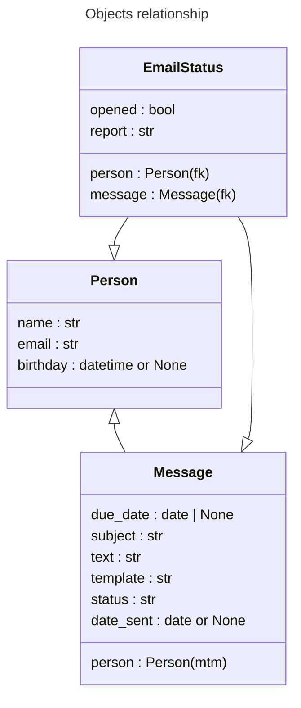

# Функционал

## Модели

### Person
Содержит имя, email и необязательный день рождения по которому можно этих пользователей фильтровать. На странице выбранного пользователя также отображается инлайн таблица связанных с ним EmailStatus объектов.

### Message
Создается после того как сообщение отправлено через форму. Содержит список получателей (many to many), необязательную дату и время будущего отправления, тему и текст сообщения, имя шаблона, cтатус, дату совершенной рассылки. На странице выбранного сообщения также отображается инлайн таблица связанных с ним EmailStatus объектов. 

По умолчанию принимает статус "Ожидает". Непосредственно перед асинхронной отправкой принимает статус "В работе", чтобы celery beat его проигнорировал. Затем принимает статус "Отправлено" или "Отменено" в зависимости от того произошла ошибка в асинхронной задаче или нет. 

Сообщения можно фильтровать по всем параметрам.

### EmailStatus
Содержит указатели на Person и Message (foreign key), статус указывающий на то, что письмо было открыто получателем, и отчет, в который записываются в виде лога такие данные как: дата создания, открытия, ошибки и так далее.

Можно фильтровать по всем параметрам кроме отчета.

## Форма создания нового сообщения
Сервис использует встроенные возможности django admin для управления рассылкой.

На страницу http://127.0.0.1:8000/admin/app/person/ добавлена кнопка __"Отправить сообщение"__ которая открывает всплывающее окно с формой отправки сообщения для выбранных пользователей. 

В форме необходимо ввести тему, сообщение и выбрать шаблон, а также необязательную дату отправления.

Если дата не указана сообщение будет отправлено немедленно всем выбранным пользователям, в противном случае его отправит celery beat настроенный на ежедневный период, каждый час с 9 - 18 часов.

Сообщение пользователя поддерживает html синтаксис и конструкции django template engine. То есть в теле письма можно отображать контент на заданных условиях используя , своершать итерации, или просто подставлять переменные {{ username }}, {{ birthday }}.

Доступен предпросмотр введенных данных на выбранном шаблоне во всплывающем окне по нажатию на кнопку __"Предпросмотр"__ рядом со списком шаблонов в форме.

## Логи
Все логи сохраняются в mailservice/log/. Для django и celery настроены по 2 лога: debug.log и error.log.

## Шаблоны
Находятся в директории mailservice/app/templates/mail_templates/

## Установка
- [rabbitmq-server](https://www.rabbitmq.com/download.html)
- python2.7
    - `python2 -m ensurepip`
    - `virtualenv -p /path/to/python2.7/bin/python .venv`
    - `source .venv/bin/activate`
    - `pip install -r requirements.txt`
    - или `pip install -r requirements-dump.txt`
- django
    - `python manage.py makemigrations`
    - `python manage.py migrate`
    - `python manage.py collectstatic`
    - `python manage.py createsuperuser`
- опционально
    - [ngrok](https://ngrok.com/docs/getting-started) 

## Тестовый запуск
Для того чтобы протестировать сервис вручную, рекомендуется:
1. установить [ngrok](https://ngrok.com/docs/getting-started), чтобы протестировать отслеживание открытия письма
1. запустить `ngrok http 8000`
1. перезапустить django сервер (сервер получит ngrok hostname сам)
1. запустить `celery -A mailservice worker -l info`
1. запустить `celery -A mailservice beat -l info`
1. загрузить фикстуры `python manage.py loaddata mailservice/app/fixtures/Person.json`
1. создать новые сообщения на странице http://127.0.0.1:8000/admin/app/person/ (кнопка "Отправить сообщение" рядом с кнопкой "добавить пользователя")
    
    
1. открыть письма на страницах https://www.1secmail.com/?login=gdflkjgld&domain=bheps.com и https://www.1secmail.com/?login=YosdfsjWlsdlfj&domain=bheps.com
    
    
1. открыть первое письмо на странице http://127.0.0.1:8000/admin/app/message/ или трекер на странице http://127.0.0.1:8000/admin/app/emailstatus/
    
    
1. создать новое отложенное сообщение с датой отправления в той же форме (либо изменить дату и статус существующего) и повторить шаги 8 и 9 когда оно будет отправлено. Celery beat отправляет отложенные письма каждый час в период с 9 - 18 (это можно изменить в `mailservice/mailservice/settings.py`)
